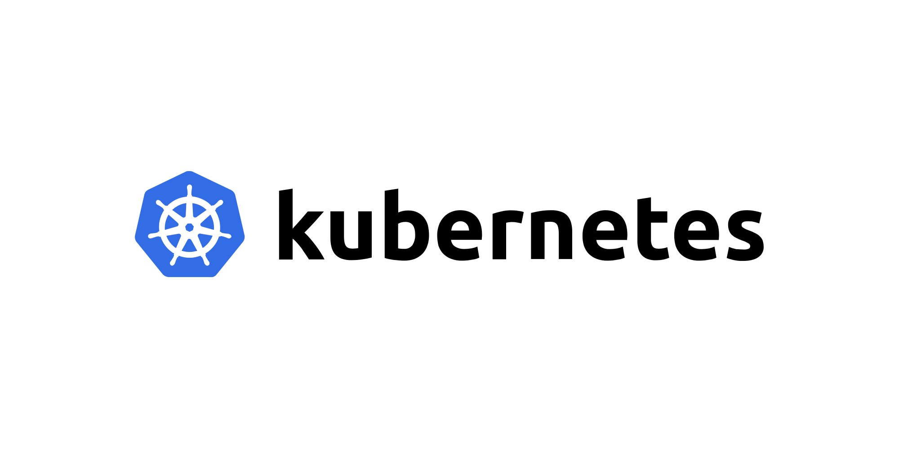

# Kubernetes beginner tutorial

In this tutorial, the basic principles of Kubernetes and how to use it are discussed. First, the basic concepts will be explained along with the commands used. Then, how to write files used in Kubernetes will be discussed and finally an example of how to implement an application in a Kubernetes cluster will be described.


# Table of contents
1. [General structure and definitions](#general-structure)
   1. [Kubernetes benefits](#kubernetes-benefits)
   2. [Kubernetes structure](#kubernetes-structure)
   3. [Kubernetes components](#kubernetes-components)
      1. [Master node components](#master-node-component)
      2. [Worker node components](#worker-node-component)
   4. [Kubernetes commands](#kubernetes-commands)
2. [How to write a YAML file](#how-to-write-a-yaml-file)
    1. [YAML file structure](#YAML-file-structure)
    2. [Example](#YAML-example)
3. [Practical example](#practical-example)
    1. [Example introduction](#example-introduction)
    2. [YAML file example](#YAML-file-example)


## Kubernetes benefits <div id='kubernetes-benefits'/>
Kubernetes provides you with:

- __Service discovery and load balancing__ Kubernetes can expose a container using the DNS name or using their own IP address. If traffic to a container is high, Kubernetes is able to load balance and distribute the network traffic so that the deployment is stable.


- __Storage orchestration__ Kubernetes allows you to automatically mount a storage system of your choice, such as local storages, public cloud providers, and more.


- __Automated rollouts and rollbacks__ You can describe the desired state for your deployed containers using Kubernetes, and it can change the actual state to the desired state at a controlled rate. For example, you can automate Kubernetes to create new containers for your deployment, remove existing containers and adopt all their resources to the new container.


- __Automatic bin packing__ You provide Kubernetes with a cluster of nodes that it can use to run containerized tasks. You tell Kubernetes how much CPU and memory (RAM) each container needs. Kubernetes can fit containers onto your nodes to make the best use of your resources.


- __Self-healing__ Kubernetes restarts containers that fail, replaces containers, kills containers that don't respond to your user-defined health check, and doesn't advertise them to clients until they are ready to serve.


- __Secret and configuration management__ Kubernetes lets you store and manage sensitive information, such as passwords, OAuth tokens, and SSH keys. You can deploy and update secrets and application configuration without rebuilding your container images, and without exposing secrets in your stack configuration.


## Kubernetes structure <div id='kubernetes-structure'/>

            

In the above figure, the overall structure of the Kubernetes cluster is presented. In this cluster, worker nodes are responsible for running Docker containers. The node master is responsible for managing the worker nodes.


## Kubernetes components <div id='kubernetes-components'/>
In order to better understand, in this section, the components related to the master node and the components related to the worker node have been examined separately.


## Master node components <div id='master-node-component'/>
  

- __etcd:__ It stores the configuration information which can be used by each of the nodes in the cluster.
- __API Server:__ API server which provides all the operation on cluster using the API
- __Controller:__ Detect state changes like crashing a pod
- __Scheduler:__ It is a service in master responsible for distributing the workload for example where to put a pod in the cluster


## Worker node components <div id='worker-node-component'/>
 

- __Pod:__ Pods contain one or more containers, such as Docker containers.
- __Docker:__ The first requirement of each node is Docker which helps in running the encapsulated application containers in a relatively isolated but lightweight operating environment.
- __Kubelet:__ It interacts with etcd store to read configuration details and wright values. This communicates with the master component to receive commands and work. 
- __Kube-Proxy:__ This is a proxy service which runs on each node and helps in making services available to the external host. It helps in forwarding the request to correct containers and is capable of performing primitive load balancing.


## Kubernetes commands <div id='kubernetes-commands'/>

```kubectl```: The Kubernetes command-line tool, kubectl, allows you to run commands against Kubernetes clusters


## How to write a YAML file <div id='how-to-write-a-yaml-file'/>


## YAML file structure <div id='YAML-file-structure'/>


## Example <div id='YAML-example'/>


## Practical example <div id='practical-example'/>


## Example introduction <div id='example-introduction'/>


## YAML file example <div id='YAML-file-example'/>